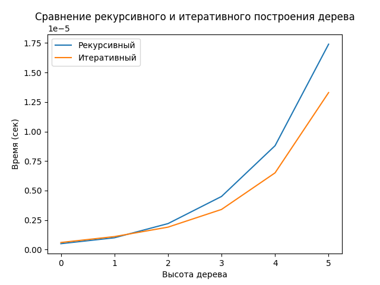

repeat = 5 -> количество повторений при выполнении функции

n -> высота дерева (от 0 до 5)

Рекурсивный способ лучше только на начале (высота = 0 и 1), но разница незаметная.
Итеративный способ намного лучше на большой дистанции (высота > 1) с заметной разницей. 

Вывод: Итеративный способ намного лучше и практичнее рекурсивного, выполняется быстрее в большинстве случаев и не загружает память так, как рекурсивный.
